# 🪙 Coin Extractor – CV Coin Detection & Extraction

A small computer vision tool to detect coins in scanned images, automatically pair their front (`..._v.jpg`) and back (`..._r.jpg`) sides, and extract them into individual, matched image files.

The future goal is to use these extracted images to search for the coins online to determine their value.

---

## Features

- 👁️ **Coin Detection**: Uses OpenCV (Canny edge detection, contour finding) to identify coin-like objects.
- 🧹 **Smart Filtering**: Filters out nested contours (e.g., details *inside* a coin) and non-square objects to isolate coins.
- 🤝 **Automatic Pairing**: Matches front-side images (e.g., `..._v.jpg`) with their corresponding back-side images (`..._r.jpg`).
- 📏 **Row-Based Matching**: Assigns detected coins to rows and matches them by their horizontal order, ensuring `coin 1 front` matches `coin 1 back`.
- ✂️ **Image Extraction**: Saves each matched pair of coin images as individual PNG files.
- 🐞 **Debug Mode**: Can generate a full suite of debug images showing each step of the CV pipeline (edges, contours, bounding boxes).
- 📊 **JSON Report**: Outputs a `extraction_results.json` file detailing all extracted coins, their source files, and their coordinates.

---

## How it Works: The CV Pipeline

The script processes images by finding edges, filtering contours, assigning rows, and then matching pairs.

### 1. Original Images

The script expects paired front (`_v`) and back (`_r`) images in the `images/` directory.

| Front (`b2_s1_v.jpg`) | Back (`b2_s1_r.jpg`) |
| :---: | :---: |
| 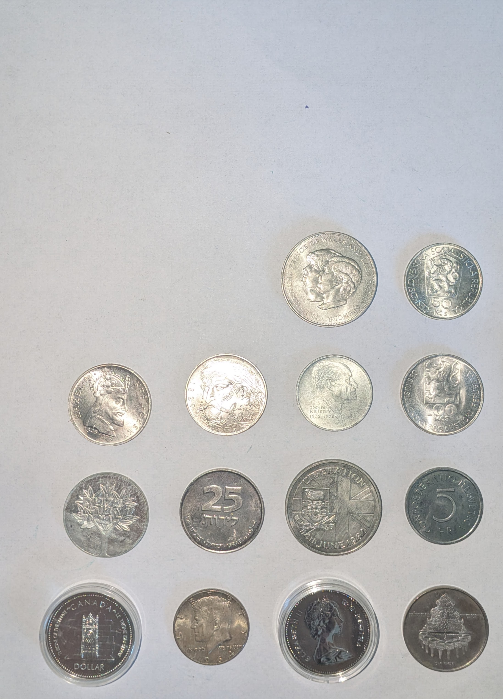 | 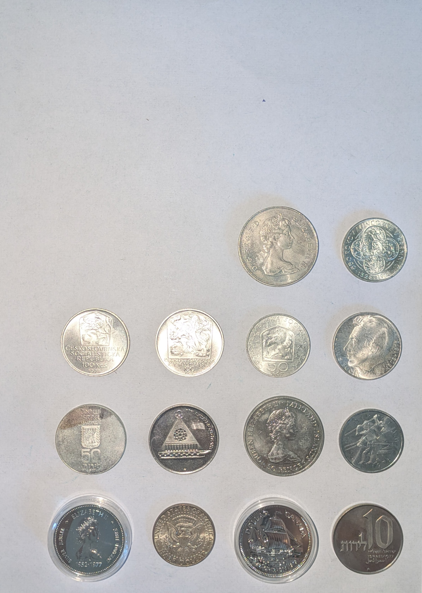 |

### 2. Debug & Detection Steps

When `save_debug=True`, the script saves its work into the `results/TIMESTAMP/debug/` folder.

| Edges | Dilated Edges | All Contours |
| :---: | :---: | :---: |
| 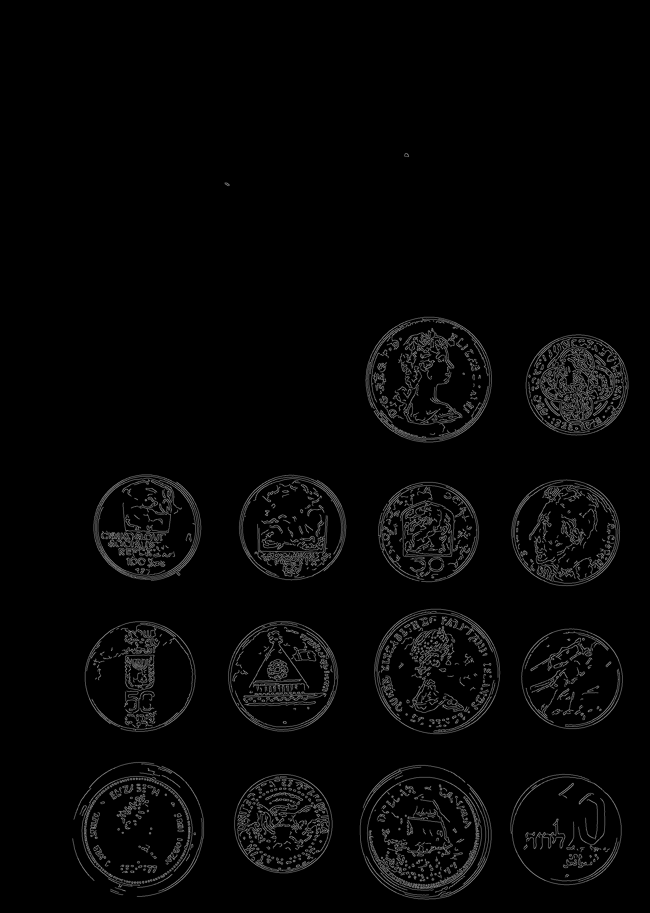 | 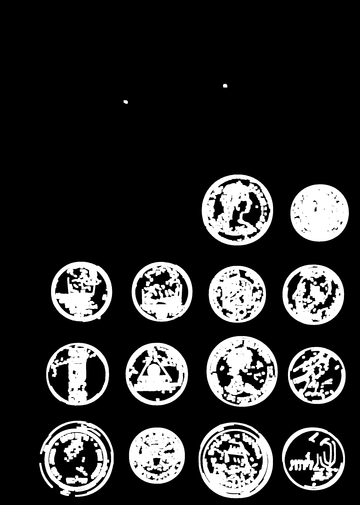 | 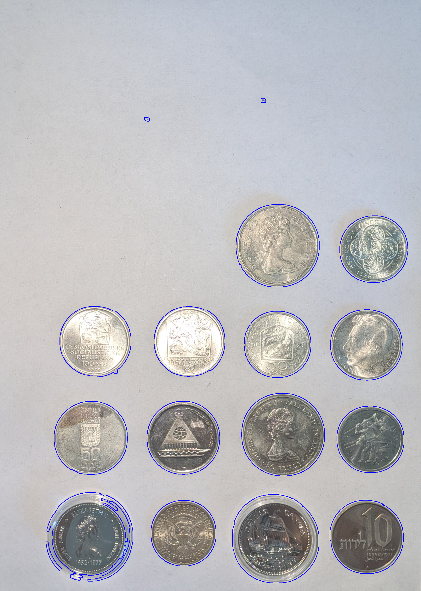 |
| **Filtered Contours** | **Row Assignment** | **Final Extraction Overview** |
| 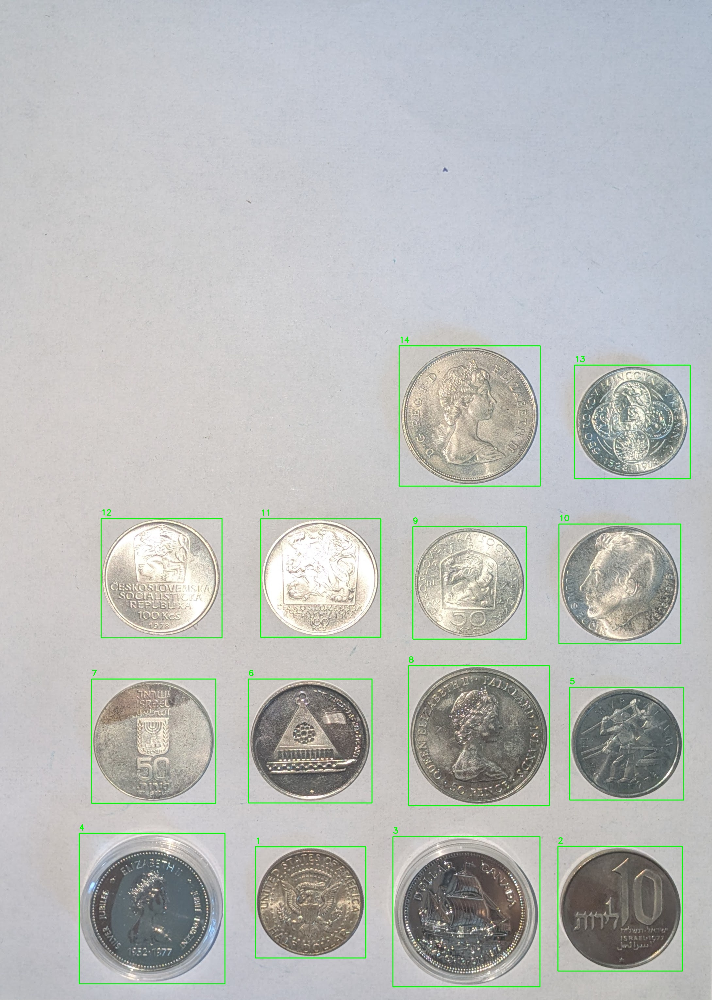 | 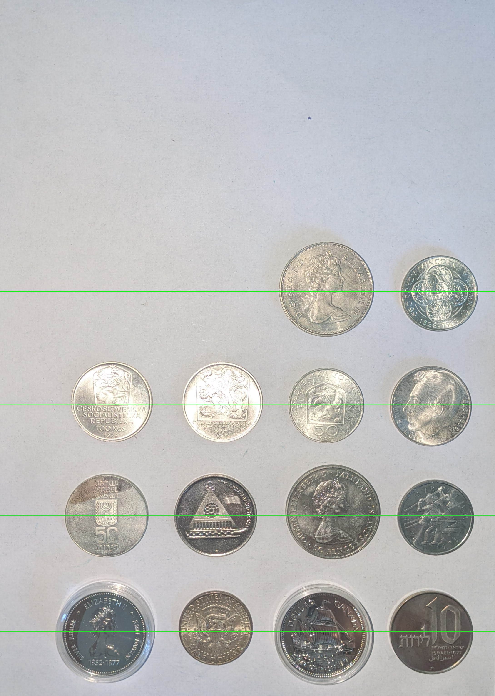 | 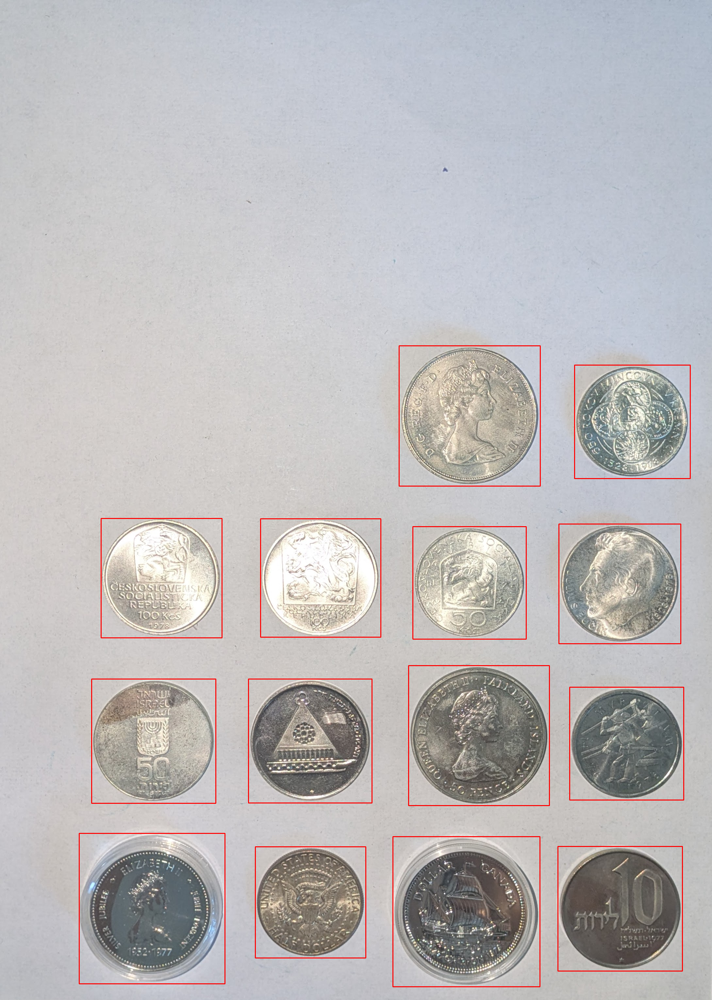 |

### 3. Extracted Coin Pairs

The final output is saved in `results/TIMESTAMP/extracted/`. The naming convention ensures front and back images sort next to each other.

| Coin 1 (Front / Back) |
| :---: |
| 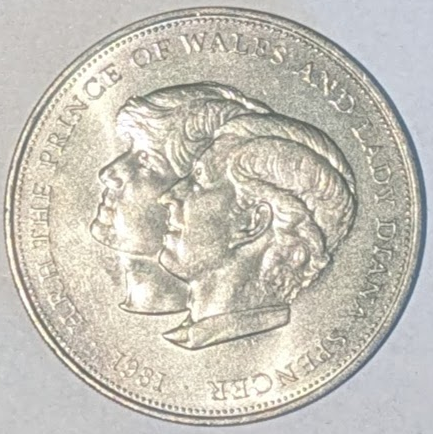 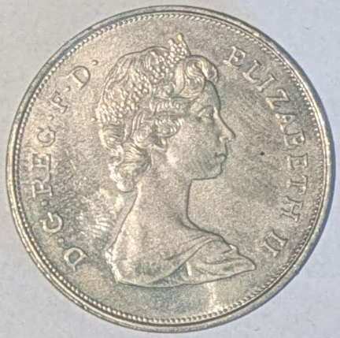 |
| **Coin 4 (Front / Back)** |
| 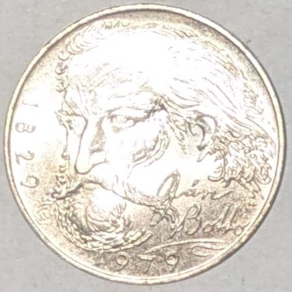 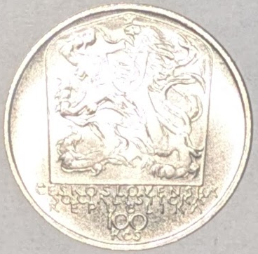 |
| **Coin 8 (Front / Back)** |
| 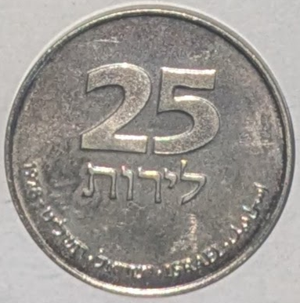 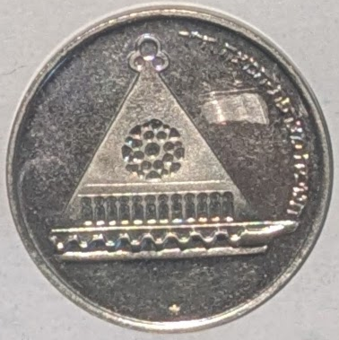 |

---

## Prerequisites

- **Python** $\geq$ 3.10
- **[uv](https://docs.astral.sh/uv/)** as the package/environment manager
- A `pyproject.toml` and `uv.lock` file (you will need to create this; see `uv init`)
- **Required Python packages**: `opencv-python`, `numpy`, `tqdm`
- **Input Directory**: An `images/` directory in the root of the project.
- **Naming Convention**: Input images *must* be named with `..._v.jpg` for the front side (Vorderseite) and `..._r.jpg` for the back side (Rückseite).

---

## Installation & Setup (Recommended with uv)

### 1) Install uv

- **macOS / Linux (Shell):**
  ~~~bash
  curl -LsSf https://astral.sh/uv/install.sh | sh
  ~~~

- **Windows (PowerShell):**
  ~~~powershell
  iwr https://astral.sh/uv/install.ps1 -UseBasicParsing | iex
  ~~~

> See the official uv documentation for alternatives.

### 2) Create Project & Install Dependencies

In your new project folder:

~~~bash
# Create a pyproject.toml (if you don't have one)
uv init

# Add dependencies
uv pip install opencv-python numpy tqdm

# Create and activate a virtual environment
uv venv

# Install the packages into the venv
uv sync
~~~

- `uv venv` creates/activates a virtual environment (default: `.venv`).
- `uv sync` installs the exact versions from your `uv.lock` file.

---

## Usage

The provided `extract_coin_images.py` script is a module. To execute, run `main.py`.

~~~bash
uv run main.py
~~~

---

## Output Structure

The script generates a new folder `results/` with a timestamped subfolder for each run.

~~~
results/
└── 2025_11_08_12_30_00/
    ├── debug/
    │   ├── b2_s1_r_all_contours.png
    │   ├── b2_s1_r_edges.png
    │   ├── b2_s1_r_edges_dilated.png
    │   ├── b2_s1_r_kept_rectangles.png
    │   ├── b2_s1_r_rows.png
    │   └── ... (many more)
    ├── extracted/
    │   ├── b2_s1_coin1_back.png
    │   ├── b2_s1_coin1_front.png
    │   ├── b2_s1_coin2_back.png
    │   ├── b2_s1_coin2_front.png
    │   └── ... (all extracted pairs)
    ├── b2_s1_r_extracted.png
    ├── b2_s1_v_extracted.png
    └── extraction_results.json
~~~

### `extraction_results.json` Format

This file contains a list of all successfully matched and extracted coin pairs, perfect for feeding into another process.

~~~json
[
  {
    "pair_key": "b2_s1",
    "coin_number": 1,
    "front_image": "b2_s1_v.jpg",
    "back_image": "b2_s1_r.jpg",
    "front_extracted": "results/2025_11_08_12_30_00/extracted/b2_s1_coin1_front.png",
    "back_extracted": "results/2025_11_08_12_30_00/extracted/b2_s1_coin1_back.png",
    "front_rect": {
      "x": 100,
      "y": 150,
      "w": 300,
      "h": 300
    },
    "back_rect": {
      "x": 102,
      "y": 148,
      "w": 301,
      "h": 301
    }
  },
  {
    "pair_key": "b2_s1",
    "coin_number": 2,
    "front_image": "b2_s1_v.jpg",
    "back_image": "b2_s1_r.jpg",
    "...": "..."
  }
]
~~~

---

## Development

- **Format/Lint** using [Ruff](https://docs.astral.sh/ruff/) (via uv):
  ~~~bash
  uv run ruff check --fix
  uv run ruff format
  ~~~

- **Quick Start in venv**:
  ~~~bash
  source .venv/bin/activate       # Linux/macOS
  .venv\Scripts\activate          # Windows
  python extract_coin_images.py --save-extracted
  ~~~

---

## Roadmap / TODO

- 🔎 **Value/Sales Search**: Implement the next step to take the extracted images and search online (e.g., Google Lens, eBay) for value.
- 🌐 **Web Interface**: Build a simple web UI (e.g., with Streamlit or Gradio) to upload images and view results interactively.
- 💡 **Improve Detection**:
  - Experiment with `cv2.HoughCircles` as an alternative to contour filtering.
  - Train a simple ML model (like a YOLOv8-nano) for more robust detection.
- 🖱️ **Manual Correction**: Add a GUI step to allow the user to manually click to remove false positives or draw boxes for missed coins.

---

## Disclaimer

This tool is provided for personal and educational use. The author is not responsible for any errors in detection, data loss, or any financial decisions made based on the script's output. Always double-check valuable items manually.